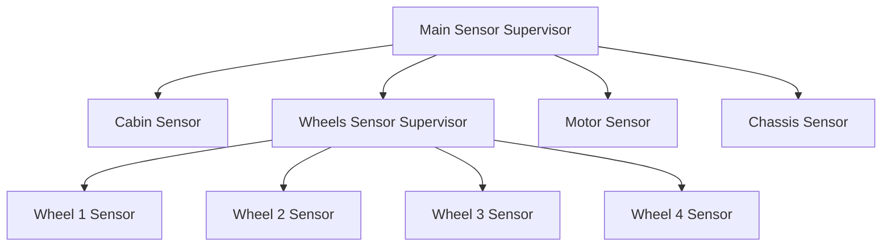

# Lab 0: Functional Programming / The Actor Model

##### Due: March 3rd, 2023

## Week 1 - Welcome..

### Minimal Task

- [x] Follow an installation guide to install the language / development environment of your choice.
- [x] Write a script that would print the message “Hello PTR” on the screen.
Execute it.

### Main Task 

- [x] Initialize a VCS repository for your project. Push your project to a remote repo.

### Bonus Task

- [x] Write a comprehensive readme for your repository.
- [x] Create a unit test for your project. Execute it.

## Week 2 - ..to the rice fields 

### Minimal Task

- [x] Write a function that determines whether an input integer is prime.
```
isPrime(13) -> True
```
- [x] Write a function to calculate the area of a cylinder, given its height and
radius.
```
cylinderArea(3, 4) -> 175.9292
```
- [x] Write a function to reverse a list.
```
reverse([1, 2, 4, 8, 4]) -> [4, 8, 4, 2, 1]
```
- [x] Write a function to calculate the sum of unique elements in a list.
```
uniqueSum([1, 2, 4, 8, 4, 2]) -> 15
```
- [x] Write a function that extracts a given number of randomly selected elements
from a list.
```
extractRandomN([1, 2, 4, 8, 4], 3) -> [8, 4, 4]
```
- [x] Write a function that returns the first $n$ elements of the Fibonacci sequence.
```
firstFibonacciElements(8) -> [0, 1, 1, 2, 3, 5, 8, 13]
```
- [x] Write a function that, given a dictionary, would translate a sentence. Words
not found in the dictionary need not be translated.
```
dictionary = {
 "mama": "mother",
 "papa": "father"
 }
 original_string = "mama is with papa"
 translator(dictionary, original_string) -> "mother is with father"
```
- [x] Write a function that receives as input three digits and arranges them in an order that would create the smallest possible number. Numbers cannot start with a 0.
```
smallestNumber(4, 5, 3) -> 345
smallestNumber(0, 3, 4) -> 304
```
- [x] Write a function that would rotate a list $n$ places to the left.
```
rotateLeft([1, 2, 4, 8, 4], 3) -> [8, 4, 1, 2, 4]
```
- [x] Write a function that lists all tuples $a, b, c$ such that $a^2+b^2=c^2$ and $a,b\leq 20$.
```
listRightAngleTriangles() -> [(3, 4, 5), (...), ..]
```

### Main Task 

- [x] Write a function that eliminates consecutive duplicates in a list.
```
removeConsecutiveDuplicates([1, 2, 2, 2, 4, 8, 4]) -> [1, 2, 4, 8, 4]
```
- [x] Write a function that, given an array of strings, will return the words that can be typed using only one row of the letters on an English keyboard layout.
```
lineWords(["Hello","Alaska","Dad","Peace"]) -> ["Alaska","Dad"]
```
- [x] Create a pair of functions to encode and decode strings using the Caesar cipher.
```
 encode("lorem", 3) -> "oruhp"
 decode("oruhp", 3) -> "lorem"
```
- [x] Write a function that, given a string of digits from 2 to 9, would return all possible letter combinations that the number could represent (think phones with buttons).
```
lettersCombinations("23") -> ["ad","ae","af","bd","be","bf","cd","ce","cf"]
```
- [x] Write a function that, given an array of strings, would group the anagrams together.
```
groupAnagrams(["eat", "tea", "tan", "ate", "nat", "bat"]) -> {
 "abt": ["bat"],
 "ant": ["nat", "tan"],
 "aet": ["ate", "eat", "tea"]
 }
```

### Bonus Task

- [x] Write a function to find the longest common prefix string amongst a list of strings.
```
commonPrefix(["flower", "flow", "flight"]) -> "fl"
commonPrefix(["alpha", "beta", "gamma"]) -> ""
```
- [x] Write a function to convert arabic numbers to roman numerals.
```
toRoman("13") -> "XIII"
```
- [x] Write a function to calculate the prime factorization of an integer.
```
factorize(13) -> [13]
factorize(42) -> [2, 3, 7]
```

## Week 3 – An Actor is Born

### Minimal Task

- [x] Create an actor that prints on the screen any message it receives.
- [x] Create an actor that returns any message it receives, while modifying it. Infer the modification from the following example:
```
> Pid ! 10. % Integers
Received : 11
> Pid ! "Hello". % Strings
Received : hello
> Pid ! {10 , "Hello"}. % Anything else
Received : I don’t know how to HANDLE this !
```
- [x] Create a two actors, actor one ”monitoring” the other. If the second actor stops, actor one gets notified via a message.
- [x] Create an actor which receives numbers and with each request prints out the current average.
```
> Pid = spawn(foo, averager, [0]).
Current average is 0
> Pid ! 10.
Current average is 5.0
> Pid ! 10.
Current average is 7.5
> Pid ! 10.
Current average is 8.75
```
- [x] Create an actor which maintains a simple FIFO queue. You should write helper functions to create an API for the user, which hides how the queue is implemented.
```
Pid = new_queue()
push(Pid, 42) -> ok
pop (Pid) -> 42
```
- [x] Create a module that would implement a semaphore.
```
Mutex = create_semaphore(0),
acquire(Mutex),
%% critical section
release(Mutex),
%% rest of the program
```
- [x] Create a module that would perform some risky business. Start by creating a scheduler actor. When receiving a task to do, it will create a worker node that will perform the task. Given the nature of the task, the worker node is prone to crashes (task completion rate $50\%$). If the scheduler detects a crash, it will log it and restart the worker node. If the worker node finishes successfully, it should print the result.
```
> Scheduler = create_scheduler()
> Scheduler ! "Hello"
Task succesful: Miau
> Scheduler ! "How are you"
Task fail
Task fail
Task fail
Task succesful: Miau
```
- [x] Create a module that would implement a doubly linked list where each node of the list is an actor.
```
DLList = create_dllist ([3, 4, 5, 42]),
traverse(DLList) -> [3, 4, 5, 42],
inverse(DLList) -> [42, 5, 4, 3].
```

## Week 4 - The Actor is dead.. Long live the Actor

### Minimal Task

- [x] Create a supervised pool of identical worker actors. The number of actors is static, given at initialization. Workers should be individually addressable. Worker actors should echo any message they receive. If an actor dies (by receiving a “kill” message), it should be restarted by the supervisor. Logging is welcome.

### Main Task

- [x] Create a supervised processing line to clean messy strings. The first worker in the line would split the string by any white spaces (similar to Python’s `str.split` method). The second actor will lowercase all words and swap all `m’s` and `n’s` (you nomster!). The third actor will join back the sentence with one space between words (similar to Python’s `str.join` method). Each worker will receive as input the previous actor’s output, the last actor printing the result on screen. If any of the workers die because it encounters an error, the whole processing line needs to be restarted. Logging is welcome.

### Bonus Task

- [x] Write a supervised application that would simulate a sensor system in a car. There should be sensors for each wheel, the motor, the cabin and the chassis. If any sensor dies because of a random invalid measurement, it should be restarted. If, however, the main sensor supervisor system detects multiple crashes, it should deploy the airbags. A possible supervision tree is attached below.



- [x] Write an application that, in the context of actor supervision, would mimic the exchange in [that scene](https://www.youtube.com/watch?v=xwT60UbOZnI) from the movie Pulp Fiction.

## Week 5 - May the Web be with you

### Minimal Task

- [x] Write an application that would visit [this link](https://quotes.toscrape.com/). Print out the HTTP response status code, response headers and response body.

- [x] Continue your previous application. Extract all quotes from the HTTP response body. Collect the author of the quote, the quote text and tags. Save the data into a list of maps, each map representing a single quote.

- [x] Continue your previous application. Persist the list of quotes into a file. Encode the data into JSON format. Name the file `quotes.json`.

### Main Task

- [x] Write an application that would implement a Star Wars-themed RESTful API. The API should implement the following HTTP methods:
    - `GET /movies`
    - `GET /movies/:id`
    - `POST /movies`
    - `PUT /movies/:id`
    - `PATCH /movies/:id`
    - `DELETE /movies/:id` 

    Use a database to persist your data. Populate the database with the following information:

    ```
    [
        {
            "id": 1,
            "title": "Star Wars: Episode IV - A New Hope",
            "release_year": 1977,
            "director": "George Lucas"
        },
        {
            "id": 2,
            "title": "Star Wars: Episode V - The Empire Strikes Back",
            "release_year": 1980,
            "director": "Irvin Kershner"
        },
        {
            "id": 3,
            "title": "Star Wars: Episode VI - Return of the Jedi",
            "release_year": 1983,
            "director": "Richard Marquand"
        },
        {
            "id": 4,
            "title": "Star Wars: Episode I - The Phantom Menace",
            "release_year": 1999,
            "director": "George Lucas"
        },
        {
            "id": 5,
            "title": "Star Wars: Episode II - Attack of the Clones",
            "release_year": 2002,
            "director": "George Lucas"
        },
        {
            "id": 6,
            "title": "Star Wars: Episode III - Revenge of the Sith",
            "release_year": 2005,
            "director": "George Lucas"
        },
        {
            "id": 7,
            "title": "Star Wars: The Force Awakens",
            "release_year": 2015,
            "director": "J. J. Abrams"
        },
        {
            "id": 8,
            "title": "Rogue One: A Star Wars Story",
            "release_year": 2016,
            "director": "Gareth Edwards"
        },
        {
            "id": 9,
            "title": "Star Wars: The Last Jedi",
            "release_year": 2017,
            "director": "Rian Johnson"
        },
        {
            "id": 10,
            "title": "Solo: A Star Wars Story",
            "release_year": 2018,
            "director": "Ron Howard"
        },
        {
            "id": 11,
            "title": "Star Wars: The Rise of Skywalker",
            "release_year": 2019,
            "director": "J. J. Abrams"
        }
    ]
    ```

### Bonus Task

- [x] Write an application that would use the Spotify API to manage user playlists. It should be able to create a new playlist, add songs to it and add custom playlist cover images.
`You will probably get to play with OAuth 2.0 and Base64 encoding.`
